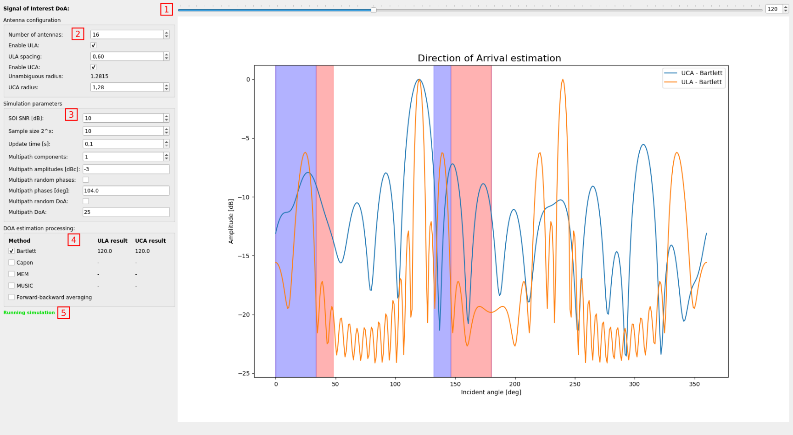

# DoA_simulator
This repository is a graphical DoA estimation simulator writen in Python.

It is able to calculate the expected output of different direction of arrival (DoA) estimation algorithms applied to phased array antenna systems. The supported antenna system arangements are the Uniform Linear Arrays (ULA), and the Uniform Circular Arrays (UCA). The simulator use the PyArgus (https://github.com/petotamas/pyArgus) library to obtain the results of the following DoA estimation algorithms:
- Barlett
- Capon
- MEM ( Maximum Entropy Method
- MUSIC (Multiple Signal Classification)

**User interface:**

***1 (SoI slider):*** With this slider the user can configure the DoA of the main signal component in the range of 0..360 deg.  
  
***2 (Antenna configuration):*** In this configuration panel the user can set the parameters of the antenna arangements and enable or disable the simulation of ULA and UCA confiugrations. The ULA spacing parameter defines the inter-element spacing in wavelength for equidistant linar antenna arrays. When set to 0.5 (half-wavelength) no aliasing will occur. The unambigious region will be 0 to 180 degree in angle. In case the spatial sampling theory is violdated (inter-element spacing is greather than the half-wavelength), the unambiguius region shrinks and this is displayed in the main results display panel as well with blue and red colors. Regions marked with the same color are related due to the aliasing effect.  

For Uniform Cirular arrays the wavelength normalized radius of the arrangement can be configured. The unambigious radious hint message shows the maximum allowed radius, where the phase distance is not greather than half-wavelength for all incident angles.
  
  
***3 (Simulation parameters):***
At the simulation parameters configuration panel the power levelel relations and the propagation parameters can be set. 
- SOI SNR [dB]: Sets the Signal-to-Noise Ratio of the signal of interest. The power of the multipath components are not considered here!
- Sample size: Sets the number of digital samples generated for the simulation. One can increase processing gain with increasing of the number of samples processed samples. E.g.: With setting this field to *10*, the number of samples will be 1024.
- Update time: Time elapsed between the consecutive simulations. In each simulation the signal of interest, the noise and the multipath parameters (if requested) are regenerated (drawn from random processes.). Minimul values is 0.1s, maximum values is 10s.
- Multipath components: Number of considered multipaths.
- Multipath amplitudes: The user can set here the power of the multipath components expressed in dBc. The input field should contain a list of float numbers sperated with ','. The given values are interpreted as dBc, relative to the main signal component. E.g.: "-3.0, -10.0", mens that the power of the second component is half of the main signal component, while the power of the third component is the 10-th of the main signal component. In case the input string is improper a warning message is shown.
- Multipath random phases: If enabled all the considered multipath signal components will have random phases for each succesive runs. The random phases are drawn from a uniform distribution in the range of 0..360.
- Multipath phases: The user can set here the phase of the multipath components in deg. The input field should contain a list of float numbers sperated with ','. E.g.: "100, 10". In case the input string is improper a warning message is shown.
- Multipath random DoA: If enabled all the considered multipath signal components will have random directions for each succesive runs. The random DoA values are drawn from a uniform distribution in the range of 0..360.
- Multipath DoA: he user can set here the DoA of the multipath components in deg. The input field should contain a list of float numbers sperated with ','. E.g.: "20, 30". In case the input string is improper a warning message is shown.

***4 (DoA estimation processing):***  
In this configuration panel the user can enable or diable the applied DoA estimation algorithms. The result columns show the measured DoA values for all the enabled methods and configurations.
  
  
***5 (Status message):***
Can have the following states:
- Running simulation: All impput parameters are correct.
- Improper multipath parameters: Parameters for the number of configured multipath components are incorrect. 
  
  

